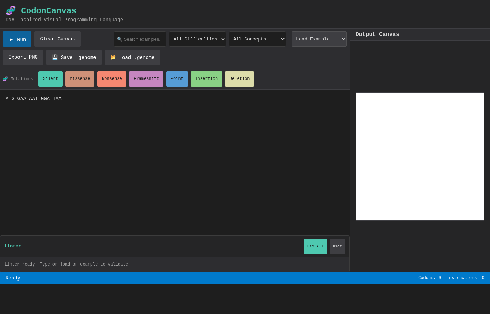

# CodonCanvas 🧬

> **DNA-Inspired Visual Programming Language**

CodonCanvas is an educational programming language that uses DNA-like triplets (codons) as syntax. Learners write sequences of three-character tokens that execute as visual outputs, making genetic concepts like mutations and reading frames tangible and playful.

## Features

- **Triplet-based syntax**: All instructions are 3-letter codons (e.g., `ATG`, `GGA`, `TAA`)
- **Genetic redundancy**: Multiple codons map to the same operation (synonymous codons)
- **Visual output**: Stack-based VM produces graphics on HTML5 canvas
- **Mutation demonstration**: Silent, missense, nonsense, and frameshift mutations
- **Directed evolution**: Evolve genomes toward target phenotypes through natural selection
- **Live playground**: Web-based editor with instant visual feedback
- **Save & Share**: Export/import genomes in .genome file format with metadata
- **Animation Export**: Export timeline animations as GIF files for sharing

## Screenshots

### Main Playground

*Interactive editor with live canvas preview, 18 built-in examples, and codon reference chart*

### Mutation Lab

*Compare original and mutated genomes side-by-side with diff visualization*

### Timeline Scrubber

*Step through execution instruction-by-instruction with state visualization*

## Quick Start

```bash
# Install dependencies
npm install

# Run development server
npm run dev
```

Then open in browser:
- Main playground: `http://localhost:5173`
- **Mutation demos: `http://localhost:5173/demos.html`** ⭐ Start here to see mutation effects!
- Mutation lab: `http://localhost:5173/mutation-demo.html`
- Timeline demo: `http://localhost:5173/timeline-demo.html`
- **Evolution lab: `http://localhost:5173/evolution-demo.html`** ⭐ NEW: Directed evolution through natural selection!

## Example: Hello Circle

```dna
ATG GAA AAT GGA TAA
```

**Explanation:**

- `ATG` - START (begin execution)
- `GAA AAT` - PUSH 3 (push value 3 to stack)
- `GGA` - CIRCLE (draw circle with radius from stack)
- `TAA` - STOP (end execution)

## Built-in Examples

The playground includes **18 pedagogical examples** demonstrating all features:

### Basic Shapes & Transforms (7)
1. **Hello Circle** - Minimal example with single circle
2. **Two Shapes** - Circle and rectangle composition
3. **Colorful Pattern** - Multiple colored shapes with rotation
4. **Line Art** - LINE primitive with rotation patterns
5. **Triangle Demo** - TRIANGLE primitive with different sizes
6. **Ellipse Gallery** - ELLIPSE with various aspect ratios
7. **Scale Transform** - SCALE opcode demonstration

### Stack & Composition (4)
8. **Stack Operations** - DUP and SWAP for efficient stack management
9. **Rosette Pattern** - Complex composition with rotation and color
10. **Simple Face** - Combines primitives to draw a smiley face
11. **Stack Cleanup** - POP opcode for stack management

### Advanced Features (4)
12. **Textured Circle** - NOISE opcode for artistic texture effects
13. **Spiral Pattern** - Geometric spiral using iterative transforms
14. **Nested Frames** - SAVE_STATE for layered compositions
15. **Mandala Pattern** - Complex radial symmetry

### Educational Demonstrations (3)
16. **Silent Mutation Demo** - Pedagogical comparison of synonymous codons (GGA vs GGC)
17. **Color Gradient** - Systematic color manipulation
18. **Grid Pattern** - Systematic positioning with TRANSLATE

## Codon Map Quick Reference

### Control Flow

- `ATG` - START
- `TAA|TAG|TGA` - STOP

### Drawing Primitives

- `GG*` (GGA, GGC, GGG, GGT) - CIRCLE
- `CC*` - RECT
- `AA*` - LINE
- `GC*` - TRIANGLE
- `GT*` - ELLIPSE

### Transforms

- `AC*` - TRANSLATE
- `AG*` - ROTATE
- `CG*` - SCALE
- `TT*` - COLOR

### Stack Operations

- `GA*` - PUSH (next codon is numeric literal)
- `AT*` (ATA, ATC, ATT) - DUP
- `TA*` (TAC, TAT), `TGC` - POP
- `TG*` (TGG, TGT) - SWAP

### Utility

- `CA*` - NOP

### Advanced Operations

- `CT*` - NOISE (seed, intensity)
- `TC*` - SAVE_STATE
- `TG*` (TGG, TGT) - SWAP

**Note:** `*` means all 4 bases create synonymous codons

## Numeric Literals (Base-4 Encoding)

After a PUSH opcode, the next codon encodes a number 0-63:

```
value = d1 × 16 + d2 × 4 + d3
where A=0, C=1, G=2, T=3
```

Examples:

- `AAA` = 0
- `CCC` = 21
- `TTT` = 63

Values are scaled: `pixel_value = (codon_value / 64) × canvas_width`

## Saving & Loading Genomes

The playground now supports saving and loading genomes in the `.genome` file format:

### Saving Your Work

Click the **💾 Save .genome** button in the playground toolbar to download your genome as a JSON file containing:

- Your genome sequence
- Title (auto-generated from first line)
- Creation timestamp
- Metadata (description, author)

### Loading Genomes

Click the **📂 Load .genome** button to import a previously saved genome file. The file will be validated and loaded into the editor.

### Exporting Animations as GIF

In the **Timeline Demo**, you can export the entire execution animation as a GIF file:

1. Load a genome and let the timeline execute
2. Click **📹 Export Animation as GIF**
3. Choose FPS (2-10) and quality settings
4. Watch the progress bar as frames are encoded
5. The GIF will automatically download when ready

GIF exports capture every step of execution, perfect for sharing on social media or embedding in documentation. Adjust FPS for smoother animation (higher file size) or faster encoding (lower FPS).

### File Format Example

```json
{
  "version": "1.0.0",
  "title": "My Beautiful Pattern",
  "description": "Created with CodonCanvas Playground",
  "author": "CodonCanvas User",
  "created": "2025-10-12T10:30:00.000Z",
  "genome": "ATG GAA AAT GGA TAA",
  "metadata": {}
}
```

### Sharing Genomes

Share your `.genome` files with others to:
- Exchange creative patterns
- Submit homework assignments
- Demonstrate mutation effects
- Build a gallery of student work

## Directed Evolution Lab

The **Evolution Lab** (`evolution-demo.html`) implements natural selection for genomes. This is a core pedagogical feature demonstrating how directed evolution works:

### How It Works

1. **Start with a genome**: Choose from built-in examples or use a custom genome
2. **Generate candidates**: Each generation creates 6 mutated variants
3. **Select the fittest**: Click on the candidate closest to your target phenotype
4. **Iterate**: Selected candidate becomes parent for next generation
5. **Observe lineage**: Watch your genome evolve across generations

### Evolution Workflow

```
Generation 1: Parent → 6 mutated candidates
              ↓ User selects fittest
Generation 2: Selected candidate → 6 new mutated candidates
              ↓ User selects fittest
Generation 3: ...continues...
```

### Key Features

- **Visual fitness selection**: User acts as fitness function by choosing fittest candidate
- **Mutation variety**: Uses point, silent, missense, insertion, and deletion mutations
- **Lineage tracking**: See evolutionary history from original to current genome
- **Export evolved genomes**: Share your evolved creations
- **Generation statistics**: Track generation number, total mutations, lineage length

### Educational Value

The Evolution Lab demonstrates:
- **Natural selection**: Only the fittest candidates reproduce
- **Cumulative change**: Small mutations accumulate into large phenotypic differences
- **Directed evolution**: Selection pressure (user choice) guides evolutionary trajectory
- **Genetic drift vs selection**: See how random mutations become fixed through selection

This hands-on experience makes abstract evolutionary concepts tangible and playful!

## Mutation Demonstration

### Silent Mutation (No Change)

```dna
ATG GAA AGG GGA TAA  → ATG GAA AGG GGC TAA
```

GGA → GGC: Both are CIRCLE, output identical

### Missense Mutation (Shape Change)

```dna
ATG GAA AGG GGA TAA  → ATG GAA AGG CCA TAA
```

GGA → CCA: CIRCLE becomes RECT

### Nonsense Mutation (Early Stop)

```dna
ATG GAA AGG GGA CCA TAA  → ATG GAA AGG TAA
```

GGA → TAA: Early STOP, second shape missing

### Frameshift (Complete Scramble)

```dna
ATG GAA AGG GGA TAA  → ATG GA AAG GGG ATA A
```

Delete first 'A': All downstream codons shift, output completely different

## Project Structure

```
codoncanvas/
├── src/
│   ├── types.ts              # Core type definitions & CODON_MAP
│   ├── lexer.ts              # Tokenizer and validator
│   ├── vm.ts                 # Stack machine VM
│   ├── renderer.ts           # Canvas2D renderer
│   ├── mutations.ts          # Mutation tools (7 types)
│   ├── diff-viewer.ts        # Genome comparison component
│   ├── timeline-scrubber.ts  # Step-through execution
│   ├── genome-io.ts          # Import/export .genome files
│   ├── examples.ts           # Built-in example genomes
│   ├── playground.ts         # Main playground UI logic
│   ├── lexer.test.ts         # Lexer tests (11 tests)
│   ├── vm.test.ts            # VM tests (20 tests)
│   ├── mutations.test.ts     # Mutation tests (17 tests)
│   └── genome-io.test.ts     # Genome I/O tests (11 tests)
├── index.html                # Main playground interface
├── mutation-demo.html        # Mutation laboratory
├── timeline-demo.html        # Timeline scrubber demo
├── package.json
├── tsconfig.json
└── vite.config.ts
```

## Development

```bash
# Install dependencies
npm install

# Run dev server
npm run dev

# Run tests
npm test

# Run tests with UI
npm run test:ui

# Type check
npm run typecheck

# Build for production
npm run build
```

## Testing

```bash
npm test
```

Test suite includes:

- Lexer tokenization and validation
- VM execution and stack operations
- Numeric literal decoding
- Mutation demonstrations
- Error handling

## Pedagogy

CodonCanvas teaches:

- **Genetic code structure**: Triplet codons, reading frames
- **Redundancy**: Synonymous codons mapping to same function
- **Mutation types**: Silent, missense, nonsense, frameshift
- **Computational thinking**: Stack-based programming, sequential execution
- **Systems thinking**: Small changes → large effects (frameshift)

## Implementation Status

✅ **Phase A: MVP Core (Completed)**

- Lexer with comment stripping and validation
- VM with all 9 opcode families (64 codons)
- Canvas2D renderer with all drawing primitives + noise
- Base-4 numeric literal encoding (0-63 range)
- Interactive playground UI with examples
- Comprehensive test suite (59 tests)

✅ **Phase B: Pedagogy Tools (Completed)**

- **Mutation Tools** (`src/mutations.ts`)
  - Silent, missense, nonsense mutations
  - Point mutations, insertions, deletions
  - Frameshift mutations (1-2 base changes)
  - compareGenomes() utility for analysis
- **Diff Viewer** (`src/diff-viewer.ts`)
  - Side-by-side genome comparison
  - Highlighted codon changes
  - Optional canvas output comparison
  - Mutation type badges
- **Timeline Scrubber** (`src/timeline-scrubber.ts`)
  - Step-through execution visualization
  - Play/pause controls with speed adjustment
  - Stack and instruction display
  - Timeline markers for each codon
- **Genome I/O** (`src/genome-io.ts`)
  - Export genomes to .genome format (JSON)
  - Import and validate .genome files
  - Download and file upload utilities
  - Integrated into main playground UI with save/load buttons
- **Interactive Demos**
  - Mutation Lab (`mutation-demo.html`)
  - Timeline Demo (`timeline-demo.html`)
- **Example Library** (`src/examples.ts`)
  - 18 pedagogical examples demonstrating all features
  - Progressive complexity from simple to advanced
  - All drawing primitives, transforms, stack operations, and noise
  - Pedagogical mutation demonstrations and educational showcases
- **NOISE Opcode Implementation**
  - Seeded pseudo-random number generator (reproducible)
  - Artistic texture effects with circular stippling
  - Intensity-based dot count and radius scaling
  - Full integration with transform system

🚧 **Phase C: Extensions (Future)**

- RESTORE_STATE opcode (requires codon reallocation)
- Audio backend for sound synthesis
- Evolutionary mode with fitness selection
- Alternative alphabets (U for RNA)
- Enhanced linter with stack depth analysis
- Visual regression testing infrastructure

## License

MIT

## Credits

Created by Kaj Kjanat based on the CodonCanvas technical specification.

Inspired by the beauty of genetic code and the desire to make molecular biology concepts tangible through creative coding.

---

**Let's evolve some code!** 🧬🎨
