```mermaid
flowchart LR
    subgraph before["Before"]
        direction LR
        B1[ATG] --> B2[GAA] --> B3[AGG] --> B4[GGA] --> B5[TAA]
    end
    
    subgraph after["After"]
        direction LR
        A1[ATG] --> A2[GAA] --> A3[AGG] --> A4[CCA] --> A5[TAA]
    end
    
    before -->|"GGA → CCA"| after
    
    subgraph out1["Before Output"]
        O1((CIRCLE))
    end
    
    subgraph out2["After Output"]
        O2[RECT]
    end
    
    B4 -.-> O1
    A4 -.-> O2
```

```mermaid
flowchart LR
    subgraph before["Before: 2 shapes"]
        direction LR
        B1[ATG] --> B2[GAA] --> B3[AGG] --> B4[GGA] --> B5[CCA] --> B6[TAA]
    end
    
    subgraph after["After: Early STOP"]
        direction LR
        A1[ATG] --> A2[GAA] --> A3[AGG] --> A4[TAA]
    end
    
    before -->|"GGA → TAA"| after
    
    subgraph out1["Before Output"]
        O1((CIRCLE)) --- O2[RECT]
    end
    
    subgraph out2["After Output"]
        O3[❌ Missing shape]
    end
```

# CodonCanvas 🧬

> **DNA-Inspired Visual Programming Language**

CodonCanvas is an educational programming language that uses DNA-like triplets
(codons) as syntax. Learners write sequences of three-character tokens that
execute as visual outputs, making genetic concepts like mutations and reading
frames tangible and playful.

## Features

- **Triplet-based syntax**: All instructions are 3-letter codons (e.g., `ATG`, `GGA`, `TAA`)
- **DNA/RNA support**: Write genomes in DNA (T) or RNA (U) notation for biological accuracy
- **Genetic redundancy**: Multiple codons map to the same operation (synonymous codons)
- **Visual output**: Stack-based VM produces graphics on HTML5 canvas
- **Timeline Scrubber**: Step-through execution like watching a ribosome translate code
- **Mutation demonstration**: Silent, missense, nonsense, and frameshift mutations
- **Directed evolution**: Evolve genomes toward target phenotypes through natural selection
- **Interactive tutorials**: Step-by-step guided learning for all major features
- **Live playground**: Web-based editor with instant visual feedback
- **Save & Share**: Export/import genomes in .genome file format with metadata
- **Animation Export**: Export timeline animations as GIF files for sharing
- **Teacher Dashboard**: Classroom analytics with student progress tracking and at-risk detection
- **Research Metrics**: Detailed engagement analytics for educational assessment and research

## Live Demo

Try CodonCanvas online (no installation required):

**[https://kjanat.github.io/codoncanvas/][demo]**

### All Demos

**For Students:**

- **[Learning Paths][learning-paths]**\
  🎓 **NEW** - Curated learning journeys from DNA basics to mathematical beauty
- **[Interactive Tutorial][tutorial]**\
  ⭐ - Step-by-step guided learning (start here!)
- **[Example Gallery][gallery]**\
  🎨 - Browse 48 examples with filters and live preview
- **[Main Playground][playground]** - Interactive editor with live canvas preview
- **[Mutation Demos][mutation-demos]** - See all mutation types in action
- **[Mutation Lab][mutation-lab]** - Side-by-side genome comparison
- **[Timeline Scrubber][timeline-scrubber]** - Step-by-step execution viewer
- **[Evolution Lab][evolution-lab]** - Directed evolution through selection
- **[Population Genetics][population-genetics]** - Observe genetic drift across populations
- **[Genetic Algorithm][genetic-algorithm]** - Automated fitness-driven evolution

**For Teachers:**

- **[Teacher Dashboard][teacher-dashboard]**\
  📊 **NEW** - Classroom analytics and student progress tracking
- **[Research Metrics Dashboard][research-dashboard]**\
  📈 Detailed engagement metrics and analysis

> [!NOTE]
> Replace `kjanat` with your GitHub username after deployment.
> See [DEPLOYMENT.md][deployment-doc] for setup instructions.

## Screenshots

### Main Playground

\
_Interactive editor with live canvas preview, 27 built-in examples, and codon reference chart_

### Mutation Lab

\
_Compare original and mutated genomes side-by-side with diff visualization_

### Timeline Scrubber

\
_Step through execution instruction-by-instruction with state visualization_

## 🎓 Learning Paths

**NEW:** Structured learning journeys guide you from genetic fundamentals to advanced mathematical concepts. Each path provides:

- **Curated Example Sequences**: Progress from simple to complex with pedagogical scaffolding
- **Concept Narratives**: Understand the "why" behind each example and its biological/mathematical significance
- **Learning Objectives**: Clear goals for each path (DNA basics, visual programming, biological patterns, mathematical art)
- **Interactive Try-It Activities**: Hands-on experiments to deepen understanding
- **Progress Tracking**: Visual progress bar shows your journey through each path

**Available Paths:**

1. **DNA Fundamentals** (20-30 min, Beginner)

   - Codon structure, silent mutations, missense/nonsense mutations, frameshifts
   - Perfect for biology students learning genetic concepts

2. **Visual Programming Journey** (30-45 min, Beginner→Intermediate)

   - Drawing primitives, transforms, state management, loops
   - Ideal for CS students learning stack-based graphics programming

3. **Nature's Algorithms** (25-35 min, Intermediate)

   - Fractal branching, phyllotaxis, cell division, hexagonal packing, DNA helix, neural networks
   - Connects biology to algorithmic patterns

4. **Mathematical Beauty** (30-40 min, Intermediate→Advanced)
   - Fibonacci spirals, golden ratio, rose curves, fractals, prime spirals
   - Explores mathematical art and computational aesthetics

**[🎓 Start Learning →][learning-paths]**

## Visual Showcase

Explore intricate compositions demonstrating the full capabilities of CodonCanvas. Each genome showcases advanced techniques like state management, noise textures, multi-layer compositions, and complex transforms.

### ⭐ NEW: Algorithmic Masterpieces

These examples demonstrate CodonCanvas's computational power using LOOP opcodes, arithmetic operations, and mathematical patterns:

- **Fibonacci Spiral** - Golden ratio approximation using arithmetic progression
- **Parametric Rose** - Mathematical rose curves with LOOP-based iteration
- **Sierpinski Approximation** - Fractal-like patterns through recursive subdivision
- **Golden Ratio Demo** - Visual proof of φ (phi) using geometric construction
- **Prime Number Spiral** - Ulam spiral visualization with LOOP efficiency

### Classic Gallery

<table>
  <tr>
    <td align="center" width="33%">
      <br />
      <b>Fractal Flower</b><br />
      <sub>Nested petals with color gradients</sub>
    </td>
    <td align="center" width="33%">
      <br />
      <b>Cosmic Wheel</b><br />
      <sub>Textured radial composition</sub>
    </td>
    <td align="center" width="33%">
      <br />
      <b>Kaleidoscope</b><br />
      <sub>6-fold radial symmetry</sub>
    </td>
  </tr>
  <tr>
    <td align="center" width="33%">
      <br />
      <b>Starfield</b><br />
      <sub>Night sky with noise textures</sub>
    </td>
    <td align="center" width="33%">
      <br />
      <b>Geometric Mosaic</b><br />
      <sub>Grid layout with rainbow gradient</sub>
    </td>
    <td align="center" width="33%">
      <br />
      <b>Recursive Circles</b><br />
      <sub>Concentric rings with rotation</sub>
    </td>
  </tr>
  <tr>
    <td align="center">
      <br />
      <b>Wavy Lines</b><br />
      <sub>Flowing wave pattern</sub>
    </td>
    <td colspan="2" align="center">
      <i>All showcase genomes available in <code>examples/</code> directory</i
      ><br />
      <i>Generate screenshots: <code>bun run generate-screenshots</code></i>
    </td>
  </tr>
</table>

## Quick Start (Local Development)

```bash
# Install dependencies
bun install

# Run development server
bun dev
```

Then open in browser:

- Main playground: `http://localhost:5173`
- **Mutation demos: `http://localhost:5173/demos.html`**\
  ⭐ Start here to see mutation effects!
- Mutation lab: `http://localhost:5173/mutation-demo.html`
- Timeline demo: `http://localhost:5173/timeline-demo.html`
- Evolution lab: `http://localhost:5173/evolution-demo.html`\
  → Directed evolution through natural selection
- **Population genetics: `http://localhost:5173/population-genetics-demo.html`**\
  ⭐ NEW: Watch genetic drift in action!

## Example: Hello Circle

**DNA Notation:**

```dna
ATG GAA AAT GGA TAA
```

**RNA Notation (biologically accurate):**

```rna
AUG GAA AAU GGA UAA
```

**Explanation:**

- `ATG`/`AUG` - _START_ (begin execution)
- `GAA AAT`/`AAU` - _PUSH_ 3 (push value 3 to stack)
- `GGA` - _CIRCLE_ (draw circle with radius from stack)
- `TAA`/`UAA` - _STOP_ (end execution)

> [!NOTE]
> CodonCanvas supports both DNA (T) and RNA (U) notation.\
> U and T are treated as synonyms - you can mix both in the same genome
> for educational demonstrations of transcription.

## Built-in Examples

The playground includes **27 pedagogical examples** demonstrating all features:

### Basic Shapes & Transforms (9)

1. **Hello Circle** - Minimal example with single circle
2. **RNA Hello** - RNA notation (U instead of T) demonstrating biological transcription
3. **RNA Composition** - More complex RNA example with multiple shapes
4. **Two Shapes** - Circle and rectangle composition
5. **Colorful Pattern** - Multiple colored shapes with rotation
6. **Line Art** - LINE primitive with rotation patterns
7. **Triangle Demo** - TRIANGLE primitive with different sizes
8. **Ellipse Gallery** - ELLIPSE with various aspect ratios
9. **Scale Transform** - SCALE opcode demonstration

### Stack & Composition (4)

1. **Stack Operations** - DUP and SWAP for efficient stack management
2. **Rosette Pattern** - Complex composition with rotation and color
3. **Simple Face** - Combines primitives to draw a smiley face
4. **Stack Cleanup** - POP opcode for stack management

### Advanced Features (4)

1. **Textured Circle** - NOISE opcode for artistic texture effects
2. **Spiral Pattern** - Geometric spiral using iterative transforms
3. **Nested Frames** - SAVE_STATE for layered compositions
4. **Mandala Pattern** - Complex radial symmetry

### Educational Demonstrations (3)

1. **Silent Mutation Demo** - Pedagogical comparison of synonymous codons (GGA vs GGC)
2. **Color Gradient** - Systematic color manipulation
3. **Grid Pattern** - Systematic positioning with TRANSLATE

### Advanced Showcase (7)

1. **Fractal Flower** - Intricate nested petals with multi-layer color gradients
2. **Geometric Mosaic** - Grid-based tiled composition with rainbow gradient
3. **Starfield** - Night sky with textured stars and nebula effects using NOISE
4. **Recursive Circles** - Concentric rings with systematic rotational offsets
5. **Kaleidoscope** - 6-fold radial symmetry with mixed shape primitives
6. **Wavy Lines** - Flowing wave pattern demonstrating systematic rotation
7. **Cosmic Wheel** - Elaborate textured composition showcasing maximum system capabilities

> [!NOTE]
> The Advanced Showcase examples demonstrate the full artistic and technical depth of CodonCanvas.\
> Each genome ranges from 960-1,620 codons (2,880-4,860 bases) and showcases advanced techniques\
> like `SAVE_STATE`, `NOISE`, multi-layer compositions, and complex transform orchestration.

## Codon Map Quick Reference

### Control Flow

- `ATG` - START
- `TAA|TAG|TGA` - STOP

### Drawing Primitives

- `GG*` (GGA, GGC, GGG, GGT) - CIRCLE
- `CC*` - RECT
- `AA*` - LINE
- `GC*` - TRIANGLE
- `GT*` - ELLIPSE

### Transforms

- `AC*` - TRANSLATE
- `AG*` - ROTATE
- `CG*` - SCALE
- `TT*` - COLOR

### Stack Operations

- `GA*` - PUSH (next codon is numeric literal)
- `AT*` (ATA, ATC, ATT) - DUP
- `TA*` (TAC, TAT), `TGC` - POP
- `TG*` (TGG, TGT) - SWAP

### Utility

- `CA*` - NOP

### Advanced Operations

- `CT*` - NOISE (seed, intensity)
- `TC*` - SAVE_STATE
- `TG*` (TGG, TGT) - SWAP

> [!NOTE]
> `*` means all 4 bases create synonymous codons

## Numeric Literals (Base-4 Encoding)

After a PUSH opcode, the next codon encodes a number 0-63:

```text
value = d1 × 16 + d2 × 4 + d3
where A=0, C=1, G=2, T=3
```

Examples:

- `AAA` = 0
- `CCC` = 21
- `TTT` = 63

Values are scaled: `pixel_value = (codon_value / 64) × canvas_width`

## Saving & Loading Genomes

The playground now supports saving and loading genomes in the `.genome` file
format:

### Saving Your Work

Click the **💾 Save .genome** button in the playground toolbar to download your
genome as a JSON file containing:

- Your genome sequence
- Title (auto-generated from first line)
- Creation timestamp
- Metadata (description, author)

### Loading Genomes

Click the **📂 Load .genome** button to import a previously saved genome file.\
The file will be validated and loaded into the editor.

### Exporting Animations as GIF

In the **Timeline Demo**, you can export the entire execution animation as a GIF
file:

1. Load a genome and let the timeline execute
2. Click **📹 Export Animation as GIF**
3. Choose FPS (2-10) and quality settings
4. Watch the progress bar as frames are encoded
5. The GIF will automatically download when ready

GIF exports capture every step of execution, perfect for sharing on social media
or embedding in documentation. Adjust FPS for smoother animation
(higher file size) or faster encoding (lower FPS).

### File Format Example

```json
{
  "version": "1.0.0",
  "title": "My Beautiful Pattern",
  "description": "Created with CodonCanvas Playground",
  "author": "CodonCanvas User",
  "created": "2025-10-12T10:30:00.000Z",
  "genome": "ATG GAA AAT GGA TAA",
  "metadata": {}
}
```

### Sharing Genomes

Share your `.genome` files with others to:

- Exchange creative patterns
- Submit homework assignments
- Demonstrate mutation effects
- Build a gallery of student work

## Directed Evolution Lab

The **Evolution Lab** (`evolution-demo.html`) implements natural selection for genomes.\
This is a core pedagogical feature demonstrating how directed evolution works:

### How It Works

1. **Start with a genome**: Choose from built-in examples or use a custom genome
2. **Generate candidates**: Each generation creates 6 mutated variants
3. **Select the fittest**: Click on the candidate closest to your target phenotype
4. **Iterate**: Selected candidate becomes parent for next generation
5. **Observe lineage**: Watch your genome evolve across generations

### Evolution Workflow

<!-- ```diagram
Generation 1: Parent → 6 mutated candidates
              ↓ User selects fittest
Generation 2: Selected candidate → 6 new mutated candidates
              ↓ User selects fittest
Generation 3: ...continues...
``` -->


### Key Features

- **Visual fitness selection**: User acts as fitness function by choosing fittest candidate
- **Mutation variety**: Uses point, silent, missense, insertion, and deletion mutations
- **Lineage tracking**: See evolutionary history from original to current genome
- **Export evolved genomes**: Share your evolved creations
- **Generation statistics**: Track generation number, total mutations, lineage length

### Educational Value

The Evolution Lab demonstrates:

- **Natural selection**: Only the fittest candidates reproduce
- **Cumulative change**: Small mutations accumulate into large phenotypic differences
- **Directed evolution**: Selection pressure (user choice) guides evolutionary trajectory
- **Genetic drift vs selection**: See how random mutations become fixed through selection

This hands-on experience makes abstract evolutionary concepts tangible and playful!

### Interactive Tutorial

First-time visitors to the Evolution Lab will see an **interactive tutorial** that guides them through:

1. Welcome to natural selection concepts
2. Generating the first set of 6 mutated candidates
3. Visual comparison and fitness evaluation
4. Selection process (clicking the fittest candidate)
5. Multi-generation evolution and lineage tracking
6. Completion with challenges and next steps

The tutorial uses localStorage to remember completion status. Reset with `window.resetEvolutionTutorial()` in console.

## Mutation Demonstration

Here are three Mermaid diagrams showing the different mutation types:

### Silent Mutation (No Change)

```mermaid
flowchart LR
    subgraph before["Before"]
        direction LR
        B1[ATG] --> B2[GAA] --> B3[AGG] --> B4[GGA] --> B5[TAA]
    end
    
    subgraph after["After"]
        direction LR
        A1[ATG] --> A2[GAA] --> A3[AGG] --> A4[GGC] --> A5[TAA]
    end
    
    before -->|"GGA → GGC"| after
    
    subgraph output["Output: Identical"]
        O1((CIRCLE))
    end
    
    after --> output
```



### Missense Mutation (Shape Change)



### Nonsense Mutation (Early Stop)



### Frameshift (Complete Scramble)


<!-- ### Silent Mutation (No Change)

```dna
ATG GAA AGG GGA TAA  → ATG GAA AGG GGC TAA
```

GGA → GGC: Both are CIRCLE, output identical

### Missense Mutation (Shape Change)

```dna
ATG GAA AGG GGA TAA  → ATG GAA AGG CCA TAA
```

GGA → CCA: CIRCLE becomes RECT

### Nonsense Mutation (Early Stop)

```dna
ATG GAA AGG GGA CCA TAA  → ATG GAA AGG TAA
```

GGA → TAA: Early STOP, second shape missing

### Frameshift (Complete Scramble)

```dna
ATG GAA AGG GGA TAA  → ATG GA AAG GGG ATA A
```

Delete first 'A': All downstream codons shift, output completely different -->

## Project Structure

```tree
codoncanvas/
├── docs/                     # User documentation
├── claudedocs/               # Internal project documentation
├── src/
│   ├── types/                # Type definitions
│   ├── playground/           # Playground UI components
│   ├── lexer.ts              # Tokenizer and validator
│   ├── vm.ts                 # Stack machine VM
│   ├── renderer.ts           # Canvas2D renderer
│   ├── mutations.ts          # Mutation tools (7 types)
│   ├── diff-viewer.ts        # Genome comparison component
│   ├── timeline-scrubber.ts  # Step-through execution
│   ├── genome-io.ts          # Import/export .genome files
│   ├── examples.ts           # Built-in example genomes
│   ├── playground.ts         # Main playground entry point
│   ├── evolution-engine.ts   # Evolution algorithm logic
│   ├── assessment-engine.ts  # Assessment system logic
│   ├── achievement-engine.ts # Gamification logic
│   ├── research-metrics.ts   # Research data collection
│   ├── teacher-dashboard.ts  # Teacher dashboard logic
│   └── ...
├── tests/
│   ├── lexer.test.ts         # Lexer validation tests
│   ├── vm.test.ts            # VM execution tests
│   ├── mutations.test.ts     # Mutation engine tests
│   ├── genome-io.test.ts     # File I/O tests
│   ├── evolution-engine.test.ts   # Evolution algorithm tests
│   ├── assessment-engine.test.ts  # Assessment system tests
│   ├── achievement-engine.test.ts # Gamification tests
│   └── ...
├── index.html                # Main playground interface
├── mutation-demo.html        # Mutation laboratory
├── timeline-demo.html        # Timeline scrubber demo
├── evolution-demo.html       # Evolution lab
├── population-genetics-demo.html # Population genetics demo
├── package.json
├── tsconfig.json
└── vite.config.ts
```

## Development

```bash
# Install dependencies
bun install

# Run dev server
bun dev

# Run tests
bun test

# Run tests with UI
bun test:ui

# Type check
bun typecheck

# Build for production
bun run build
```

## Testing

```bash
bun test
```

Test suite includes:

- Lexer tokenization and validation
- VM execution and stack operations
- Numeric literal decoding
- Mutation demonstrations
- Error handling

## Pedagogy

CodonCanvas teaches:

- **Genetic code structure**: Triplet codons, reading frames
- **Redundancy**: Synonymous codons mapping to same function
- **Mutation types**: Silent, missense, nonsense, frameshift
- **Computational thinking**: Stack-based programming, sequential execution
- **Systems thinking**: Small changes → large effects (frameshift)

### For Educators

CodonCanvas provides comprehensive classroom support tools:

**📊 Teacher Dashboard** ([teacher-dashboard.html][teacher-dashboard])

- **Classroom Analytics**: View aggregate metrics across all students (engagement distribution, average sessions/duration/genomes)
- **Student Progress Tracking**: Monitor individual tutorial completion and research metrics
- **At-Risk Detection**: Identify students needing intervention with color-coded severity levels
- **Export Capabilities**: Generate CSV grading summaries or JSON data exports for further analysis
- **Privacy-Preserving**: All data handled client-side with no server transmission (FERPA-compliant)

**Workflow:**

1. Students complete activities and click "📊 Export Progress" button in playground
2. Students save their progress file (JSON format) and submit to teacher
3. Teacher opens Teacher Dashboard and imports multiple student files via drag-and-drop
4. Dashboard displays comprehensive analytics: stats grid, at-risk alerts, completion matrix, engagement metrics
5. Teacher exports grading summary (CSV) or detailed classroom data (JSON) as needed

**📈 Research Metrics** ([research-dashboard.html][research-dashboard])

- **Session Analytics**: Deep-dive into individual learning sessions with timestamps and actions
- **Engagement Patterns**: Track genomes created, mutations applied, tutorial progress, time-to-first-artifact
- **Educational Research**: Support pedagogical studies with detailed interaction data
- **Visual Analysis**: Interactive visualizations of engagement trends and learning trajectories

See [EDUCATORS.md][educators-doc] for complete lesson plans, assessment rubrics, and classroom activities.

## Implementation Status

✅ **Phase A: MVP Core (Completed)**

- Lexer with comment stripping and validation
- VM with all 9 opcode families (64 codons)
- Canvas2D renderer with all drawing primitives + noise
- Base-4 numeric literal encoding (0-63 range)
- Interactive playground UI with examples
- Comprehensive test suite (233 tests across 15 test files)

✅ **Phase B: Pedagogy Tools (Completed)**

- **Mutation Tools** (`src/mutations.ts`)
  - Silent, missense, nonsense mutations
  - Point mutations, insertions, deletions
  - Frameshift mutations (1-2 base changes)
  - compareGenomes() utility for analysis
- **Diff Viewer** (`src/diff-viewer.ts`)
  - Side-by-side genome comparison
  - Highlighted codon changes
  - Optional canvas output comparison
  - Mutation type badges
- **Timeline Scrubber** (`src/timeline-scrubber.ts`)
  - Step-through execution visualization
  - Play/pause controls with speed adjustment
  - Stack and instruction display
  - Timeline markers for each codon
- **Genome I/O** (`src/genome-io.ts`)
  - Export genomes to .genome format (JSON)
  - Import and validate .genome files
  - Download and file upload utilities
  - Integrated into main playground UI with save/load buttons
- **Interactive Demos**
  - Mutation Lab (`mutation-demo.html`)
  - Timeline Demo (`timeline-demo.html`)
- **Example Library** (`src/examples.ts`)
  - 18 pedagogical examples demonstrating all features
  - Progressive complexity from simple to advanced
  - All drawing primitives, transforms, stack operations, and noise
  - Pedagogical mutation demonstrations and educational showcases
- **NOISE Opcode Implementation**
  - Seeded pseudo-random number generator (reproducible)
  - Artistic texture effects with circular stippling
  - Intensity-based dot count and radius scaling
  - Full integration with transform system

🚧 **Phase C: Extensions (Future)**

- RESTORE_STATE opcode (requires codon reallocation)
- Audio backend for sound synthesis
- Alternative alphabets (U for RNA)
- Enhanced linter with stack depth analysis
- Visual regression testing infrastructure

## Deployment

Deploy CodonCanvas to GitHub Pages for public access:

```bash
# 1. Create GitHub repo and add remote
git remote add origin https://github.com/YOUR_USERNAME/codoncanvas.git
git push -u origin master

# 2. Enable GitHub Pages (Settings → Pages → Source: GitHub Actions)

# 3. Automatic deployment on every push to master

# Live at: https://YOUR_USERNAME.github.io/codoncanvas/
```

See [DEPLOYMENT.md][deployment-doc] for complete instructions including:

- Social sharing optimization (Open Graph tags)
- Custom domain setup
- Troubleshooting guide
- Local production testing

## License

[MIT][license]

## Credits

Created by Kaj Kjanat based on the CodonCanvas technical specification.

Inspired by the beauty of genetic code and the desire to make molecular biology concepts tangible through creative coding.

---

**Let's evolve some code!** 🧬🎨

<!-- Link definitions -->

[demo]: https://kjanat.github.io/codoncanvas/
[learning-paths]: https://kjanat.github.io/codoncanvas/learning-paths.html
[tutorial]: https://kjanat.github.io/codoncanvas/tutorial.html
[gallery]: https://kjanat.github.io/codoncanvas/gallery.html
[playground]: https://kjanat.github.io/codoncanvas/
[mutation-demos]: https://kjanat.github.io/codoncanvas/demos.html
[mutation-lab]: https://kjanat.github.io/codoncanvas/mutation-demo.html
[timeline-scrubber]: https://kjanat.github.io/codoncanvas/timeline-demo.html
[evolution-lab]: https://kjanat.github.io/codoncanvas/evolution-demo.html
[population-genetics]: https://kjanat.github.io/codoncanvas/population-genetics-demo.html
[genetic-algorithm]: https://kjanat.github.io/codoncanvas/genetic-algorithm-demo.html
[teacher-dashboard]: https://kjanat.github.io/codoncanvas/teacher-dashboard.html
[research-dashboard]: https://kjanat.github.io/codoncanvas/research-dashboard.html
[deployment-doc]: ./docs/DEPLOYMENT.md
[educators-doc]: ./docs/EDUCATORS.md
[license]: ./LICENSE

<!-- markdownlint-disable-file MD033 -->
